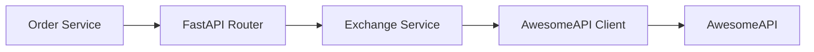

# Arquitetura

## Componentes

- `app/main.py`: define rotas, metricas e handlers de erro.
- `app/services/exchange_service.py`: valida conta, normaliza moedas e monta a resposta.
- `app/clients/awesome_api_client.py`: encapsula a chamada HTTP para a AwesomeAPI.
- `app/models.py`: modelos de entrada e saida com Pydantic.
- `tests/test_exchange_api.py`: cobertura dos fluxos principais.

## Tratamento de erro

- Moedas invalidas retornam `422`.
- Ausencia do header `id-account` retorna `401`.
- Falhas do provedor externo retornam `502`.
